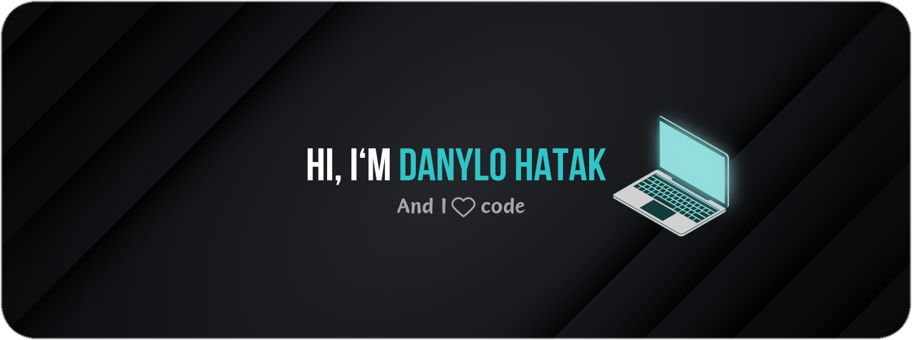

<!--  -->

<!--
**NEYROSICK/neyrosick** is a ✨ _special_ ✨ repository because its `README.md` (this file) appears on your GitHub profile.

Here are some ideas to get you started:

- 🔭 I’m currently working on
- 🌱 I’m currently learning React Native
- 💬 Ask me about ...
- 📫 How to reach me: ...
- ⚡ Fun fact: ...
-->

### Hey there 👋

I'm Danylo, a junior full-stack developer. Love creating applications with beautiful designs and powerfull functionalities also learning new technologies and practices everyday. Passionate about building user-friendly UI with best UX.

- ⚙️ I’m currently working on self development
- 👨‍🎓 I graduated from the [GoIT](https://goit.ua/?lang=uk) academy
- 🔭 I'm currently learning React Native
- 🚀 The next technology to explore will be TypeScript
- 📈 I'm motivated to become a better developer
- 😄 Fun fact: my best skill is fixing 🪲 (bugs)
- 📫 How to reach me: dhatak24@gmail.com

## Skills:

## Stats:

 

## Get in touch ☕

[-%2300000.svg?style=for-the-badge&logo=X&logoColor=white&color=black)](https://twitter.com/dhatak24)
